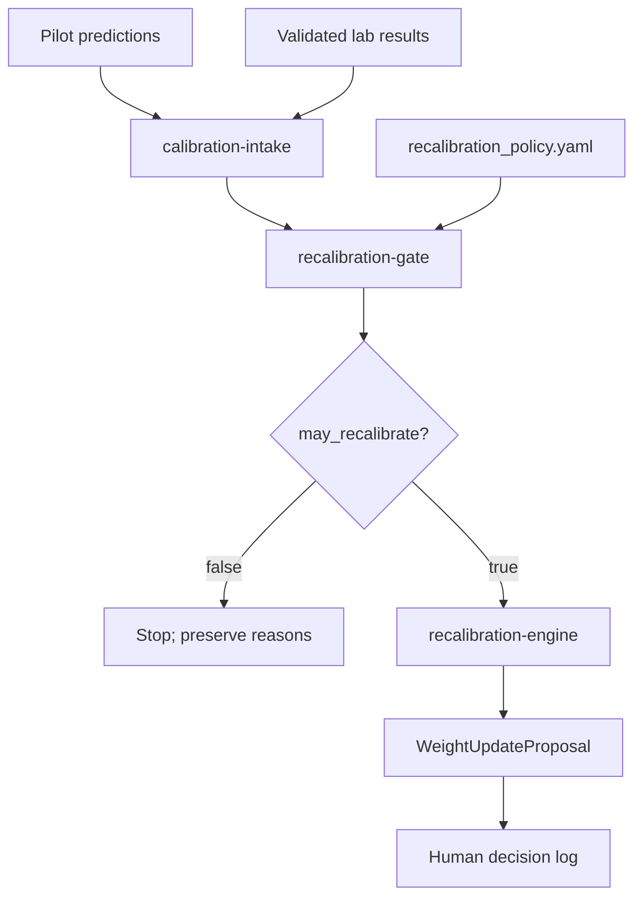
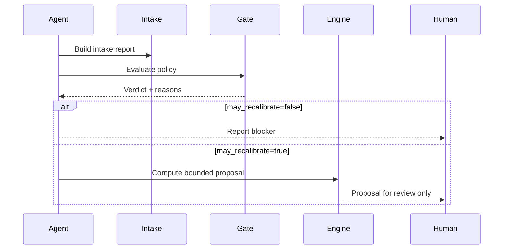

# Calibration Module

## Overview

This module owns wet-lab feedback governance. It ingests validated assay
results, evaluates whether recalibration is allowed, proposes bounded weight
deltas, and guards policy edits. It does not apply weight changes.

## Key Components

- `intake.py` joins pilot-panel predictions with lab-result actuals and emits a
  descriptive calibration-intake report.
- `policy.py` loads and validates `configs/recalibration_policy.yaml`.
- `recalibration_gate.py` evaluates intake reports against the policy and emits
  a binary `may_recalibrate` verdict.
- `engine.py` computes proposed weight deltas only after the gate permits it.
- `policy_version.py` compares current and previous policy files so silent
  recalibration-policy drift fails without a version bump and decision log.

## Diagrams (Mermaid)

## Guardrails

- Never treat intake metrics as permission to recalibrate.
- Never apply weight changes from `engine.py`; it proposes only.
- Any substantive policy edit requires `policy_version` increase, unchanged
  prior `locked_changes`, and a fresh `docs/DECISION_LOG_YYYY-MM-DD.md`.
- Keep toxicity, hemolysis, novelty, pathogen-enhancement, and post-hoc
  success-redefinition prohibitions locked unless human governance changes the
  project safety policy explicitly.
